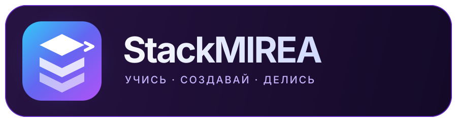
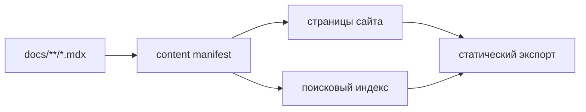

<div align="center">
  

  <p><strong>Учебные практики, конспекты и ноутбуки — в формате современной документации.</strong></p>

  <p>
    <a href="https://minkinad.github.io/StackMIREA/">Открыть сайт</a>
    ·
    <a href="https://minkinad.github.io/StackMIREA/docs/">Смотреть материалы</a>
    ·
    <a href="./CONTRIBUTING.md">Предложить изменение</a>
  </p>

  <p>
    <a href="https://github.com/minkinad/StackMIREA/actions/workflows/deploy-gh-pages.yml"></a>
    <a href="https://github.com/minkinad/StackMIREA/actions/workflows/pr-check.yml"></a>
    
    
    <a href="./LICENSE"></a>
  </p>
</div>

## О проекте

StackMIREA — статическая образовательная платформа для IT-дисциплин РТУ МИРЭА. Она объединяет учебные треки, практические работы, ноутбуки и дополнительные материалы в одном интерфейсе.

Внутри есть:

- каталог учебных треков с боковой навигацией, хлебными крошками и оглавлением;
- локальный поиск по материалам на странице «Спроси StackMIREA»;
- MDX-страницы с подсветкой кода и переиспользуемыми компонентами;
- ссылки на авторов и исходники материалов;
- автоматическая проверка структуры, метаданных, ссылок и поискового индекса;
- статическая публикация в GitHub Pages.

## Быстрый старт

Понадобятся Git и Node.js 20 или новее.

```bash
git clone https://github.com/minkinad/StackMIREA.git
cd StackMIREA
npm ci
npm run dev
```

После запуска сайт будет доступен на <http://localhost:3000>.

## Как всё устроено

```text
app/          маршруты и страницы Next.js
components/   интерфейс и MDX-компоненты
docs/         редактируемые учебные материалы
lib/          навигация, поиск и работа с manifest
resources/    датасеты и файлы для практик
scripts/      сборка и проверка контента
public/       статические и сгенерированные ассеты
```

`docs/` — единственный источник учебного контента. Во время подготовки проекта из него собираются `.cache/content-manifest.json` и `public/search-index.json`:



Не редактируйте manifest и поисковый индекс вручную — используйте команды проекта.

## Основные команды

| Команда | Назначение |
| --- | --- |
| `npm run dev` | Подготовить контент и запустить локальную разработку |
| `npm run build` | Собрать статический сайт в `out/` |
| `npm run quality` | Проверить manifest, ссылки, метаданные и поисковый индекс |
| `npm test` | Запустить тесты контентного движка и приложения |
| `npm run lint` | Проверить код с ESLint |
| `npm run typecheck` | Проверить типы TypeScript |
| `npm run prepare:content` | Пересобрать manifest и поисковый индекс |

Полный локальный прогон перед pull request:

```bash
npm run quality
npm test
npm run lint
npm run typecheck
npm run build
```

Отчёты о качестве контента сохраняются в `.cache/content-report.json` и `.cache/content-report.html`.

## Добавление материала

1. Выберите существующий трек в `docs/` или заведите новый трек одновременно в `lib/tracks.json`.
2. Создайте Markdown- или MDX-файл с обязательными полями `title`, `description`, `author` и `order` либо `sidebar_position`.
3. Добавьте воспроизводимые примеры, подпишите языки блоков кода и проверьте ссылки.
4. Запустите `npm run quality` и `npm test`.
5. Откройте pull request и кратко опишите изменения.

Подробные правила и чеклисты собраны в [руководстве для контрибьюторов](./CONTRIBUTING.md). Инструкции для кодовых агентов находятся в [AGENTS.md](./AGENTS.md).

## Помощь и сообщество

- [История изменений](./CHANGELOG.md) — новые возможности, исправления и заметки о релизах.
- [Поддержка](./SUPPORT.md) — куда обратиться с вопросом или проблемой.
- [Кодекс поведения](./CODE_OF_CONDUCT.md) — правила общения в проекте.
- [Политика безопасности](./SECURITY.md) — как приватно сообщить об уязвимости.
- [Шаблоны issues](./.github/ISSUE_TEMPLATE/) — ошибки, идеи и обновления контента.

## Лицензии

Код распространяется по [лицензии MIT](./LICENSE). Учебные материалы — по [CC BY-NC-SA 4.0](./CC-BY-NC-SA-4.0).
